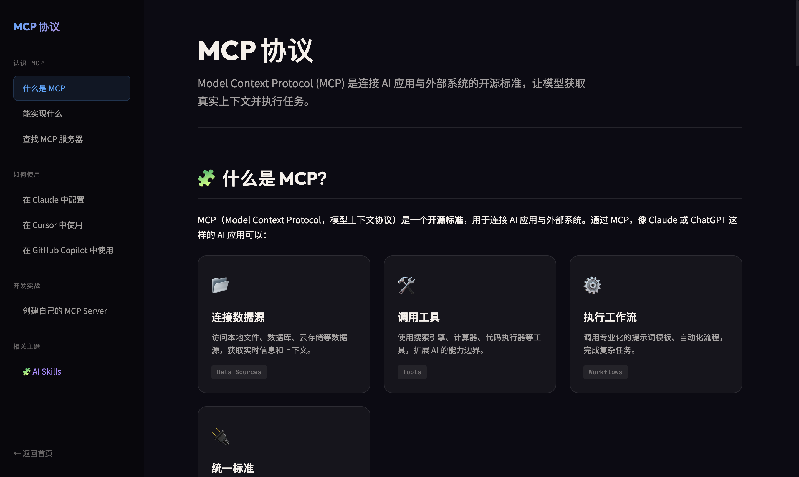
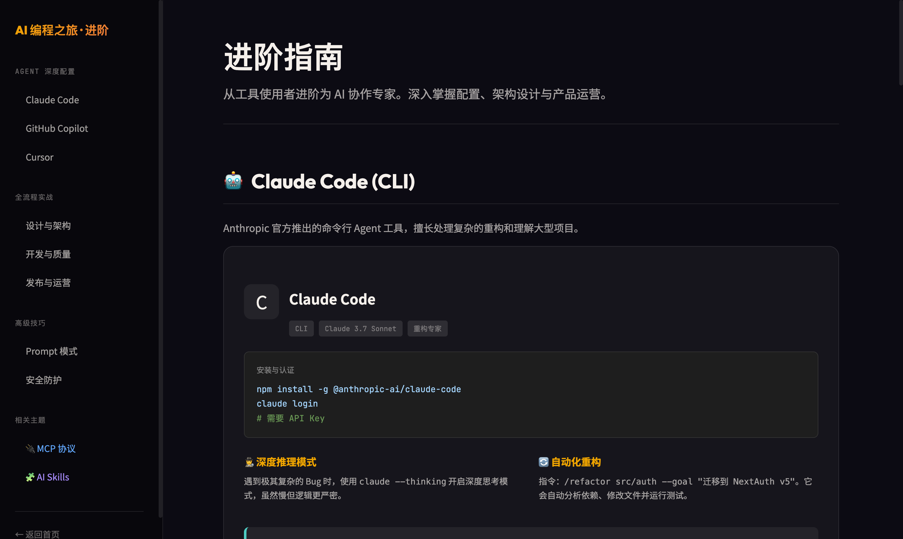

# 🤖 AI Coding Learning

> 面向 AI 开发者的系统性学习文档站点 —— 从工具入门到高级实战，全面覆盖 AI 辅助编程的核心知识体系。

🌐 **在线访问**：[https://sjjliqpl.github.io/ai-coding-learning](https://sjjliqpl.github.io/ai-coding-learning)

---

## 📸 页面预览

### 首页 · 进阶指南


### MCP 协议


### AI Skills


### 高级专题


---

## 📚 内容介绍

本项目是一套暗色风格的静态文档站点，采用侧边栏导航 + 分章节内容的布局，共包含四个页面：

### 1. 首页 / 进阶指南（`index.html`）
带有精美卡片和分区展示，是整个站点的入口和导航中心，涵盖各 AI 工具和主题的快速概览与跳转入口。

### 2. AI 编程进阶指南（`advanced.html`）
深入解析三大主流 AI 编程工具的使用技巧：

| 工具 | 核心功能 |
|------|----------|
| **Claude Code (CLI)** | 深度推理模式、自动化重构、大型项目理解 |
| **GitHub Copilot** | `@workspace` 全项目上下文、Slash Commands、VS Code 深度集成 |
| **Cursor** | `.cursorrules` 规范配置、Composer 多文件编辑、`@Docs` 文档索引 |

还包括：
- 🏗️ **设计与架构**：前后端交互规范、组件拆分原则
- 🐛 **开发与质量**：交叉审查（Cross-Check）、TypeScript 防御型开发
- 🚀 **发布与运营**：PostHog 数据埋点、自动化 SEO 方案
- 🗣️ **Prompt 模式**：链式思考（CoT）、角色扮演等高级技巧
- 🛡️ **安全防护**：`.env` 管理、API Key 保护等最佳实践

### 3. MCP 协议（`mcp.html`）
全面介绍 Model Context Protocol（模型上下文协议）：

- **什么是 MCP**：AI 连接外部系统的开源标准（类比 USB-C 接口）
- **能实现什么**：个人助理、设计到代码、企业数据分析、创意制造
- **如何查找 MCP 服务器**：官方仓库、社区目录、NPM/PyPI 搜索
- **配置教程**：Claude Desktop、Cursor、GitHub Copilot 的详细配置步骤
- **创建自己的 MCP Server**：完整 Python（FastMCP）代码示例

### 4. AI Agent Skills（`skills.html`）
系统介绍 Agent 技能（Skills）体系：

- **什么是 Skills**：包含指令、脚本和资源的能力包，按需动态加载
- **为什么需要**：补足上下文、复用能力、稳定流程、跨工具共享
- **Skill 结构**：基于 `SKILL.md` + YAML Frontmatter 的标准格式
- **哪里找 Skills**：Anthropic 官方仓库、agentskills.io 开放标准
- **使用方式**：在 Claude Code、Claude.ai、API 中如何调用
- **创建指南**：明确场景 → 编写 SKILL.md → 迭代验证的完整流程
- **最佳实践**：触发条件、标准化示例、验证步骤、模块化拆分

---

## 🗂️ 项目结构

```
ai-coding-learning/
├── docs/
│   ├── index.html        # 首页 / 站点入口
│   ├── advanced.html     # AI 编程进阶指南
│   ├── mcp.html          # MCP 协议详解
│   ├── skills.html       # AI Agent Skills
│   └── screenshots/      # README 截图
├── LICENSE
└── README.md
```

---

## 🚀 本地运行

```bash
git clone https://github.com/sjjliqpl/ai-coding-learning.git
cd ai-coding-learning/docs

# 方法一：直接用浏览器打开
open index.html

# 方法二：本地静态服务器
python -m http.server 8000
# 访问 http://localhost:8000
```

---

## 🛠️ 技术栈

- 纯静态 HTML / CSS / JavaScript，无框架依赖
- 字体：[Outfit](https://fonts.google.com/specimen/Outfit)、[Noto Sans SC](https://fonts.google.com/noto/specimen/Noto+Sans+SC)、[JetBrains Mono](https://fonts.google.com/specimen/JetBrains+Mono)
- 暗色主题设计，响应式布局，支持移动端访问
- 侧边栏滚动高亮导航（Scroll Spy）

---

## 🤝 贡献指南

欢迎提交 PR 完善内容！

```bash
git checkout -b feature/your-topic
# 修改 docs/ 中的 HTML 文件
git add docs/
git commit -m "Add: your topic description"
git push origin feature/your-topic
```

---

## 📄 许可证

MIT License. 详见 [LICENSE](LICENSE) 文件。
