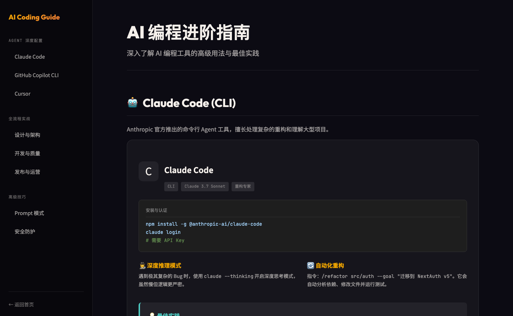
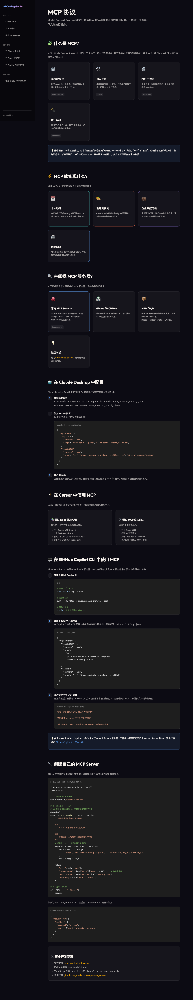
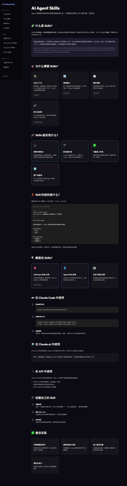
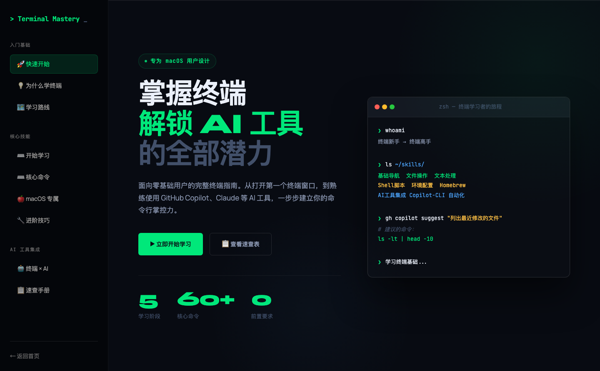

# AI 编程之旅 — 从零开始，创造产品

> 一站式 AI 编程学习指南，涵盖主流 AI 编程工具的入门与进阶。

🔗 **在线访问**: [https://sjjliqpl.github.io/ai-coding-learning/](https://sjjliqpl.github.io/ai-coding-learning/)

## 📖 内容

| 页面 | 说明 |
|-------------|---------------------|
| **首页** | 核心概念、学习路线、推荐工具、互动体验 |
| **AI 编程进阶** | Claude Code / GitHub Copilot / Cursor 深度用法 |
| **MCP 协议** | Model Context Protocol 入门与实战 |
| **AI Skills** | Agent 技能体系与创建指南 |
| **终端掌控术** | 终端基础、核心命令、macOS 技巧、AI 工具集成 |
| **Markdown 入门** | Markdown 语法速成与工具推荐 |
| **Git & GitHub** | 版本控制入门与 GitHub 协作 |
| **接入第三方模型** | Copilot CLI BYOK、Claude Code 自定义模型、DeepSeek/智谱/千问/Kimi/MiniMax 接入指南 |

## 🛠️ 技术栈

- **React 19** + **TypeScript** + **Vite**
- **React Router** (HashRouter) — 适配 GitHub Pages
- 暗色主题 · 玻璃拟态卡片 · 滚动动画
- **i18n** 中英文切换

## 🚀 开发

```bash
npm install       # 安装依赖
npm run dev       # 启动开发服务器 (localhost:5173)
npm run build     # 构建到 docs/ 目录
npm run preview   # 预览构建结果
```

## 📁 项目结构

```
src/
├── components/     # 共享组件 (Layout, Sidebar)
├── pages/          # 页面组件
├── styles/         # 全局样式 + 各页面样式
├── i18n/           # 国际化
├── App.tsx         # 路由配置
└── main.tsx        # 入口
public/
└── screenshots/    # 页面截图
docs/               # 构建输出 (GitHub Pages)
```

## 📸 截图

### 首页


### AI 编程进阶指南


### MCP 协议


### AI Skills 清单


### 掌握终端


### 接入第三方模型


## 📜 License

[MIT](LICENSE)